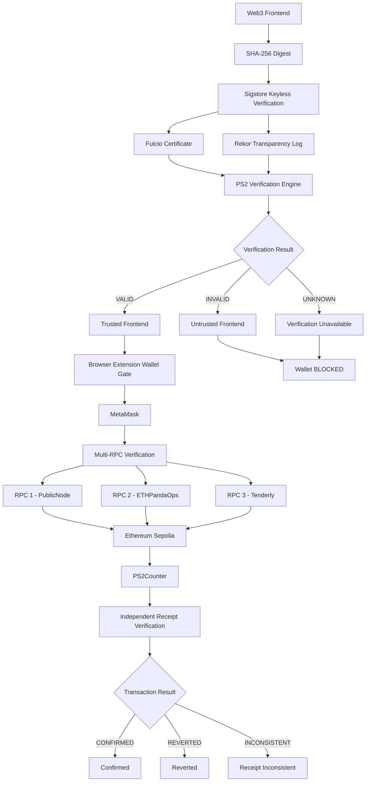

# 🔐 Keyless Web3 Release — Anti-DNS Hijack

**PS2** is a Web3 security system that cryptographically verifies a dApp frontend **before allowing wallet interaction**.

## Problem

A DNS or hosting compromise can replace a legitimate Web3 frontend with a malicious one.

**HTTPS alone does not prove that the frontend is the authorized release.**

##  PS2 Architecture

PS2 separates frontend delivery from frontend authenticity and wallet authorization.



### Security Model

PS2 uses a **browser-extension-controlled, fail-closed wallet gate**.

If the frontend cannot be cryptographically verified, wallet interaction is blocked before the request reaches MetaMask.

The verification states are:

* **VALID** → frontend is trusted and wallet interaction can proceed.
* **INVALID** → frontend is rejected and wallet interaction is blocked.
* **UNKNOWN** → verification could not be established, so wallet interaction remains blocked.

##  How PS2 Stops a Frontend Attack

### 1. Legitimate Frontend

The authorized release is downloaded and verified.

```text
✓ PS2 VERIFIED
Sigstore: VALID
Rekor: VERIFIED
```

The frontend's SHA-256 digest must match the trusted release metadata.

### 2. Simulated DNS / Hosting Attack

A copy of the legitimate frontend is modified:

```text
PS2 Web3 Security Demo
        ↓
PS2 Web3 Security Demo — HACKED
```

The modified frontend produces a different SHA-256 digest:

```text
Expected digest ≠ Actual digest
```

PS2 detects the mismatch and blocks wallet interaction:

```text
FRONTEND VERIFICATION FAILED
DO NOT CONNECT YOUR WALLET.
```

The trusted release itself is never modified.

##  Independent Frontend Recovery

If the normal frontend delivery path is unavailable or compromised, PS2 can retrieve the authorized release from an independent source.

The recovered frontend is **not automatically trusted**.

PS2 verifies:

1. SHA-256 digest
2. Sigstore signature
3. Fulcio certificate
4. Signer identity
5. Certificate issuer
6. Rekor transparency evidence

Only a successful cryptographic verification results in a trusted frontend.

## IPFS and Independent Distribution

Content-addressed systems such as IPFS can provide an additional independent distribution path for frontend releases.

The important principle is:

> **Distribution and authenticity are separate concerns.**

IPFS can provide content-addressed availability, while PS2 uses SHA-256 and Sigstore verification to establish authenticity.

PS2's security model does not rely on IPFS alone.

##  Multi-RPC Verification

PS2 uses multiple independent Ethereum Sepolia RPC providers for blockchain reads.

Configured RPC providers:

* PublicNode
* ETHPandaOps
* Tenderly

PS2 compares responses to detect:

* RPC failures
* inconsistent results
* lack of consensus

Normal differences in block height are handled separately from actual data inconsistencies.

### Transaction Flow

MetaMask remains responsible for signing and broadcasting transactions.

PS2 does **not** handle private keys or seed phrases.

After MetaMask returns a transaction hash, PS2 independently checks the transaction receipt across multiple RPC providers.

Possible states:

```text
PENDING
CONFIRMED
REVERTED
RECEIPT_INCONSISTENT
```

##  Verification Tests

##  Security Properties

* **Keyless Sigstore signing**
* **Fulcio certificate verification**
* **Rekor transparency verification**
* **SHA-256 release integrity**
* **Browser extension wallet gate**
* **Fail-closed verification**
* **Independent frontend recovery**
* **Multi-RPC consensus**
* **Independent transaction receipt verification**
* **No private keys handled by PS2**

## ⛓️ Network

**Ethereum Sepolia**

Chain ID:

```text
11155111
```

### PS2Counter Contract

```text
0xaf8ce8203A15795cAA6C92b10B10e351c05dBb0F
```

## Public Sigstore Evidence

Release digest:

```text
2400c6017562583ca99830790a6bdf5b7dcd3e1f4864c5b41aa921bddad086d2
```

Public Sigstore transparency search:

https://search.sigstore.dev/

Search using:

```text
sha256:2400c6017562583ca99830790a6bdf5b7dcd3e1f4864c5b41aa921bddad086d2
```

## Live Demo

The live demonstration shows:

1. **Legitimate frontend** → verification succeeds.
2. **Modified frontend** → digest mismatch is detected.
3. **Wallet protection** → unverified frontend is blocked.
4. **Frontend recovery** → authorized release is independently recovered and verified.
5. **Multi-RPC verification** → blockchain data is compared across multiple providers.
6. **Transaction verification** → MetaMask transaction receipt is independently verified.

## Core Idea

> **Don't trust the website just because HTTPS works. Verify the frontend before trusting the wallet interaction.**

**PS2 turns frontend provenance into a security boundary for Web3 wallets.**

---

### MADE BY TEAM VERENCE
